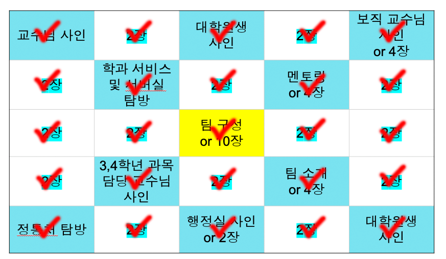

<header>
  <meta http-equiv="refresh" content="0;url=https://sharon77770.github.io/eureka-2024-210/test.html">
</header>

# **Eureka Team.10 (Class 2)**

- [팀 소개](#팀-소개)  
- [팀원 소개](#팀원-소개)  

## **팀 소개**

### **구성원**

| 역할   | 이름                |
|--------|---------------------|
| 팀장   | 김영광               |
| 팀원   | 손수환, 손재현, 장우진, 주민재, 하인우 |

---

### **팀 슬로건**

> **"Like debug for the bug"**  
> 개발할 때 디버깅하여 버그를 제거하듯, 살면서 문제가 생기면 무시하지 말고 문제를 차분히 해결하자.  

---

### **관심사**

- #### **공통 관심사**
  - 알고리즘

- #### **조금은 덜 관심사**
  - 머신러닝과 인공지능 

---

### **알아보고 싶은 기회들 (소융대 제공)**

1. **자동차·SW·디자인 융합전공**  
   - 자동차 + 소프트웨어 + 자동차디자인  
2. **소프트웨어학부 트랙제**  
   - 빅데이터·머신러닝 트랙  
   - 미디어·엔터테인먼트 트랙  
   - IoT융합 트랙  
   - 웹·정보보호 트랙  
   - 엔터프라이즈SW 트랙  
3. **경진대회**  
   - 자율주행경진대회  
   - ICPC  
   - 국민대학교 & 중앙대학교 연합 프로그래밍 경진대회  
4. **해외 교육 프로그램**  
   - 글로벌 경험과 학습의 기회  
   - GREAT Program

---

### **발표 때 받은 질의 응답**
  - #### 예상한 질문
    - 임베디드 언제부터 하셨나요?
    - 왜 해킹에 관심을 가지시나요?
    - 어떤 교수님의 답변이 가장 인상 깊었나요?
    - 유레카 활동 중 배운 것
    - 멘토링에서 배운점이 무엇인가요?
    - 정보보안 커리큘럼이 어떻게 되어있나요?
 
  - #### 예상못한 질문
    - 서버실 자원을 AI에 사용해보고 싶다고 하셨는데, 어디에 사용하실 생각이신가요?
    - 크로스 플랫폼에 대해 어떤건지 알려주실 수 있나요?
    - 게임 개발에 관심이 있다는데 관심있는 엔진이 있나요?
    - 수학에 관심이 많은데 어느 분야에 관심이 있으시나요?
    - 교수님이나, 대학원생 선별기준이 있나요?

  - #### 질문과 답변 후 느낀점
    - 예상못한 질문에 대한 답변을 드릴 때 **"아 내가 이런 지식을 가지고 있어서 임기응변을 할 수가 있었구나 더 많은 지식을 넓혀서 다른 사람한테 인터뷰 대상으로 요청 받을 때나 구체적인 목표를 설정할 수가 있겠다"** 라고 깨닫게 해주었습니다.

---

### **빙고**

- 티켓 개수는 약 30개 + @로 모든 빙고를 다 채웠습니다.

 

## **팀원 소개**

- [김영광](#김영광-팀장)  
- [주민재](#주민재)  
- [장우진](#장우진)  

---

### **김영광 팀장**

- #### **개인 정보**
  - | 항목       | 내용                                      |
    |------------|-------------------------------------------|
    | 이름       | 김영광                                    |
    | 학번       | 20243033                                  |
    | 학과       | 소프트웨어학부                           |
    | 입학 전형  | 국민프런티어 전형 (소프트웨어학부 24학번) |
    | MBTI       | ENFJ-T                                   |

- #### **경력**
  - 아지트 소모임 회장
  - 수학학원 강사
  - 고등학교 여름방학 생기부 특강 강사 초빙
  - 제 13회 대한민국 주산암산경기대회 금상
  - 제 14회 대한민국 주산암산경기대회 금상
  - 고등학교 1학년 수학개념말하기대회 대상

- #### **취미**
  - 맛집 탐방
  - 주산암산

- #### **특기**
  - 수학 문제 풀이
  - 수학 이론 정리 증명

- #### **장점**
  - 책임감
  - 성실성
  - 리더십
  - 사교성

- #### 팀 활동 중에 배운점

  - 팀 내 협업을 통해 다양한 관점을 접하며 사고의 폭을 넓힐 수 있었습니다.  
 서로 다른 커리어와 목표를 가진 팀원들과의 소통을 통해 존중과 배움의 중요성을 깨달았으며,  
 이는 제 자신을 더욱 성장시키는 계기가 되었습니다.

- #### 나의 인생 목표와 커리어 계획
  - 정보보안 전문가로서 안전한 시스템을 구축하고 해킹 위협에 대응하는 것이 목표입니다.  
 이를 위해 대학원에서 심화된 연구를 진행하며 전문성을 갖추고자 합니다.

- #### 커리어를 위한 학교 생활 계획
  - 다양한 보안 관련 프로젝트에 참여하고, 최신 기술 트렌드를 익히기 위해  
 관련 세미나와 워크숍에 적극적으로 참여할 계획입니다.

- #### 커리어를 위해 계획한 소융대 제공 기회   
  - 자동차 SW 커리큘럼 과목을 수강하며 기술적 기반을 다질 계획입니다.  
 또한, GREAT 프로그램을 통해 어학연수를 진행하고, 멘토링을 통해  
 외부 전문가와의 네트워킹 기회를 활용하여 실무 통찰을 얻고자 합니다.

- #### **하고 싶은 말**
  > "게으르면 뒤쳐진다"  

---

### **주민재 조원**

- #### **개인 정보**
  - | 항목         | 내용                                                       |
    |--------------|------------------------------------------------------------|
    | 이름         | 주민재                                                     |
    | 학번         | 20243118                                                   |
    | 학과         | 소프트웨어학부                                            |
    | 입학 전형    | 소프트웨어 특기자 전형 (소프트웨어학부 24학번)                |
    | 개인 페이지  | [sharon77770.github.io/Sharon77770/](https://sharon77770.github.io/Sharon77770/) |
    | MBTI         | ENTP                                                       |

- #### **경력**
  - Unity 기반 오픈월드 3D TPS RPG 게임 [The Van of Justice](https://store.steampowered.com/app/1761660/The_Van_of_Justice/) 개발
  - [KMU Agit](http://agit.xn--9i1b01onwqqzd.xn--3e0b707e/) 소모임 커뮤니티 플랫폼 구축 (Agit 통합계정, 게시판, 보안 채팅, REST API 제공)
  - 리그오브레전드 팀 밸런싱 디스코드 봇 [자이라 봇](https://koreanbots.dev/bots/1146381094975983716) 제작
  - BLE RSSI 기반 [블루투스 거리 측정 앱](https://github.com/Sharon77770/ble-finder) 개발
  - 삼성전자공과대학교 Python강사
  - 국민대학교 알고리즘 대회 장려상

- #### **취미**
  - 게임
  - 토이 프로젝트 진행

- #### **특기**
  - 다양한 프로그래밍 언어 및 프레임워크 활용
  - 프로젝트 관리 및 풀스택 프로젝트

- #### **장점**
  - 넓은 개발 분야
  - 빠른 학습 속도
  - 다양한 개발 스택

- #### 팀 활동 중에 배운 점
  - 저의 수준과 앞으로 목표로 해야할 수준을 알게 되었습니다. 
  - 업무 능력 외에도 협업에 있어서 도움되는 기술들을 배웠습니다.

- #### 나의 인생 목표와 커리어 계획
  - 누구도 대체 할수 없는 다재다능한 개발자가 되고싶습니다. 
  이를 위해 좀더 넓은 기술을 익히고 기존에 도전하지 않은 분야의 프로젝트를 진행 할 예정입니다. 

- #### 커리어를 위한 학교 생활 계획
  - 인공지능 분야를 좀더 깊게 공부하고 융합 프로젝트를 진행하고자 합니다.
  - 학우들과의 더 활발한 소통으로 몰랐던 분야의 이야기를 알아가고자 합니다.

- #### 커리어를 위해 계획한 소융대 제공 기회
  - 경진 대회와 트랙제를 활용해 넓은 분야에 대해 숙련도를 다져나가고 싶습니다.

- #### **하고 싶은 말**
  > "내가 컴퓨터가 되어선 안된다."  

---

### **장우진 조원**

- #### **개인 정보**
  - | 항목       | 내용                                      |
    |------------|-------------------------------------------|
    | 이름       | 장우진                                    |
    | 학번       | 20243110                                  |
    | 학과       | 소프트웨어학부                           |
    | 입학 전형  | 국민프런티어 전형 (소프트웨어학부 24학번) |
    | MBTI       | ENTJ - INTJ                               |

- #### **경력**
  - **고등학교 2학년**:  
    - 메타버스를 활용한 고등학교 신입생 학교 소개서 제작 프로젝트  
    - 카카오톡 데이터 센터 화재 관련 뉴스 댓글 분석 프로젝트
  - **고등학교 3학년**:  
    - 자율주행 자동차 모델 개발 (하드웨어)  
    - t주차 및 기타 자율주행 관련 제어 구현 프로젝트
  - **대학교 1학년**:  
    - 딥러닝 관련 스터디 참여  
    - ROS2(로봇 운영체제) 스터디 팀장

- #### **취미**
  - 축구
  - 싸이클
  - 게임

- #### **특기**
  - 물리 문제 풀이
  - 수학 문제 풀이
  - 요리

- #### **장점**
  - 책임감
  - 성실성
  - 리더십
  - 사교성

- #### 팀 활동 중에 배운 점
  -팀 활동에서의 협업을 통해 서로의 다양한 강점과 약점을 이해하며, 효율적인 팀워크를 이끌어내는 법을 배웠습니다. 특히, 각자 고유한 경험과 배경을 바탕으로 문제를 바라보는 시각이 다르다는 점이 흥미로웠고, 이를 통해 제 사고의 폭을 넓히는 데 큰 도움을 받았던 것 같습니다.
팀원들이 가진 다양한 아이디어와 접근 방식을 존중하며 함께 의견을 조율해나가는 과정은 단순히 결과물뿐만 아니라, 협업 자체의 가치를 깊이 느끼게 해주었습니다. 이러한 경험을 통해, 개인의 성장이 결국 팀의 성과로 이어진다는 점을 깨닫게 되었고, 앞으로도 팀원들과의 긍정적인 시너지를 만들어가는 데 주력하고 싶습니다.

- #### 나의 인생 목표와 커리어 계획
  - 제 인생 목표는 자율주행차와 컴퓨터 비전 기술을 통해 사람들의 삶을 더 안전하고 편리하게 만드는 것입니다. 저는 자율주행차가 단순한 기술 혁신을 넘어, 교통사고를 줄이고 이동의 효율성을 높이며, 누구나 평등하게 이동할 수 있는 미래를 만들어갈 핵심적인 역할을 한다고 믿습니다. 이를 실현하기 위해, 저는 컴퓨터 비전 기술의 연구와 응용을 중심으로 커리어를 설계하고 있습니다. 특히, 객체 인식, 거리 측정, 경로 예측과 같은 핵심 기술을 깊이 탐구하고, 관련 대회나 발표회에 참가할 것이고 이를 실제로 구현할 수 있는 실무 역량을 쌓는 것을 목표로 하고 있습니다.

- #### 커리어를 위한 학교 생활 계획
  - 다양한 컴퓨터 비전 관련 프로젝트에 참여하고, 최신 기술 트렌드를 익히기 위해  
    관련 세미나와 워크숍에 적극적으로 참여할 계획입니다. 2학년때는 알파 프로젝트를 통해 1학년떄 다져논 딥러닝과 ROS2를 통해 자율주행차를 팀원들을 모아 만들어 볼 계획이며 또한 자율주행만이 아닌 자율주행에 필요한 ui나 다른 파트 들도 만들어 볼 계획입니다. 또한 컴퓨터 비전 관련 대회나 해커톤에 참여하여 실질적인 문제를 해결하는 경험을 쌓고 학부 연구생으로서 컴퓨터 비전에 대해 자세히 연구해보고 싶고 자율주행 관련 연구에 참여하여 전문성을 늘릴것이며 이런 과정에서 일어나는 협업 능력을 함께 키워 나갈 것입니다. 4학년때는 인턴쉽을 통해 관련 회사에서 일하며 실무능력을 키워 나갈 것이며 능력을 통해 만들어 낸 결과물을 통해 논문이나 포스터 형식으로 발표하여 학문적 성과를 내고자 합니다.

- #### 커리어를 위해 계획한 소융대 제공 기회
  - 자동차 SW 커리큘럼 과목을 수강하며 기술적 기반을 다질 계획이고
    또한, GREAT 프로그램을 통해 어학연수를 진행하고, 멘토링을 통해  
    외부 전문가와의 네트워킹 기회를 활용하여 실무 통찰을 얻고자 합니다.
    그리고 국민대학교 AIZONE에서 제공하는 AI 및 산업혁명 분야 관련 온라인 강의와 로드맵을 적극적으로 활용하여 저의 목표를 위한 역량 강화를 이루어내고자 합니다.

- #### **하고 싶은 말**
  > "즐기면서 살자!"  

---

### **하인우 조원**

- #### **개인 정보**
  - | 항목       | 내용                                      |
    |------------|-------------------------------------------|
    | 이름       | 하인우                                    |
    | 학번       | 20243128                                  |
    | 학과       | 소프트웨어학부                           |
    | 입학 전형  | 국민프런티어 전형 (소프트웨어학부 24학번) |
    | MBTI       | INTJ                                      |

- #### **경력**
  - **고등학교 2학년**:  
    - LSTM 기반 seq2seq 형식의 인공지능 채팅 봇 개발  
    - 사용자 정보 기반 연간 의료비 예측 인공지능 개발  
    - 교육용 교내 커뮤니티 사이트 개발  
  - **고등학교 3학년**:  
    - 수학 코딩 동아리 창설  
    - 파이썬 기초교육 및 수학 관련 라이브러리 사용 교육 커리큘럼 작성  
    - CNN 기반 욕설 필터링 서비스 개발  
    - 교육용 영상 스트리밍 서비스 개발  
  - **대학교 1학년**:  
    - 2024년도 1학기 기후변대응사업단 타전공 파이썬 교육 봉사 참여  
    - 임베디드 소프트웨어 경진대회 수상  
    - KOSS 주최 해커톤 수상  
    - 2024년 2학기 산학협력 프로젝트 학부연구생 자격 참여  

- #### **취미**
  - 웹툰
  - 독서

- #### **특기**
  - 탐구 및 문제 해결

- #### **장점**
  - 책임감
  - 성실성
  - 탐구심

- #### 팀 활동 중에 배운 점
  - 다양한 활동을 통해 소프트웨어 개발과 관련된 실무 지식과 경험을 쌓았습니다.  
  - 제 자신의 한계를 인식하고 이를 극복할 방법을 고민하며 성장의 기회를 얻었습니다.  
  - 팀원들과의 협업을 통해 소통의 중요성을 배우고, 개발자로서 필요한 요소들을 체감했습니다.  
  - 앞으로도 꾸준히 배우고 도전하며 목표를 이루기 위해 노력하겠습니다.

- #### 나의 인생 목표와 커리어 계획
  - 많은 사람들에게 공감받을 수 있는 기술이나 서비스를 개발하는 것이 목표입니다.  
  - 이를 위해 해커톤에 참가하고, 단순한 개발 역량뿐만 아니라 창의적 사고와 기획 역량을 키우고자 합니다.  
  - 특히, 평소 사용하지 않던 새로운 기술을 배우고 적용하는 대회나 발표회에 적극 참여할 계획입니다.

- #### 커리어를 위한 학교 생활 계획
  - 다양한 해커톤과 대회에 참가하며 경험을 쌓고, 컴퓨터 이외의 다양한 분야도 공부할 예정입니다.  
  - 또한, 다양한 세미나에 참석하여 시야를 넓히고 새로운 관점을 배워 나가고자 합니다.

- #### 커리어를 위해 계획한 소융대 제공 기회
  - GREAT 프로그램을 통해 국내외의 기술과 환경을 경험하고 이를 바탕으로 창업지원 프로그램에 도전할 계획입니다.

- #### **하고 싶은 말**
  > "후회 없이 살자, 안되겠지만"  

---

### **손수환 조원**

- #### **개인 정보**
  - | 항목       | 내용                                      |
    |------------|-------------------------------------------|
    | 이름       | 손수환                                    |
    | 학번       | 20243066                                  |
    | 학과       | 소프트웨어학부                           |
    | 입학 전형  | 국민프런티어 전형 (소프트웨어학부 24학번) |
    | MBTI       | INTP                                      |

- #### **경력**
  - **고등학교 2학년**:  
    - 코딩 동아리 창설  
    - 학교생활 도우미앱 개발  
  - **고등학교 3학년**:  
    - 학교 안내 키오스크 제작  
  - **대학교 1학년**:  
    - 2024년 2학기 교과목 헬퍼  

- #### **취미**
  - 코딩
  - 리듬게임

- #### **특기**
  - 탐구 및 문제 해결

- #### **장점**
  - 호기심
  - 성실성
  - 반응속도

- #### 팀 활동 중에 배운 점
  - 팀 활동을 통해 학업과 관련된 질문과 소통을 나누며 서로 알아가는 과정이 인상 깊었습니다.  
  다양한 관점을 접하며 협업의 중요성을 깨달았고, 이를 통해 개인적으로 성장할 수 있었습니다.

- #### 나의 인생 목표와 커리어 계획
  - 개발자로서 대기업에 취업하는 것을 목표로 하고 있습니다.  
  이를 위해 코딩테스트 대비를 위한 알고리즘 학습과 토이 프로젝트를 기획하며 실력을 키우고 있습니다.

- #### 커리어를 위한 학교 생활 계획
  - 토이 프로젝트를 진행하며 대회에 참가해 프로젝트 및 협업 경험을 쌓을 예정입니다.

- #### 커리어를 위해 계획한 소융대 제공 기회
  - 멘토링 프로그램에서 얻은 협업 경험과 조언을 활용하여 실무에 필요한 역량을 강화할 계획입니다.

- #### **하고 싶은 말**
  > "노3성 천장은 안된다"  

---

### **손재현 조원**

- #### **개인 정보**
  - | 항목       | 내용                                      |
    |------------|-------------------------------------------|
    | 이름       | 손재현                                    |
    | 학번       | 20243067                                  |
    | 학과       | 소프트웨어학부                           |
    | 입학 전형  | 농어촌학생전형                            |
    | MBTI       | ISFJ                                      |

- #### **경력**
  - 충청남도 중/고등학생 알고리즘 대회 및 Intel AI for Youth 참가 및 수상
  - p5.js - handpose 활용 게임 개발
  - OpenAI API를 활용한 모교 마스코트 개발 프로젝트 조장
  - 학원 수학 강사

- #### **취미**
  - 게임
  - 음악 감상
  - 목적지 없이 걷기

- #### **특기**
  - 수학 문제 풀이

- #### **장점**
  - 관심 있는 분야에 대한 끊임없는 도전
  - 계획과 실행이 대부분 이어진다

- #### 팀 활동 중에 배운 점
  - 팀 내 협업을 통해 다양한 관점을 접하며 사고의 폭을 넓힐 수 있었습니다.  
    서로 다른 커리어와 목표를 가진 팀원들과의 소통을 통해 존중과 배움의 중요성을 깨달았으며,  
    이는 제 자신을 더욱 성장시키는 계기가 되었습니다.

- #### 나의 인생 목표와 커리어 계획
  - 정보보안 전문가로서 안전한 시스템을 구축하고 해킹 위협에 대응하는 것이 목표입니다.  
    이를 위해 대학원에서 심화된 연구를 진행하며 전문성을 갖추고자 합니다.

- #### 커리어를 위한 학교 생활 계획
  - 다양한 보안 관련 프로젝트에 참여하고, 최신 기술 트렌드를 익히기 위해  
    관련 세미나와 워크숍에 적극적으로 참여할 계획입니다.

- #### 커리어를 위해 계획한 소융대 제공 기회
  - 자동차 SW 커리큘럼 과목을 수강하며 기술적 기반을 다질 계획입니다.  
    또한, GREAT 프로그램을 통해 어학연수를 진행하고, 멘토링을 통해  
    외부 전문가와의 네트워킹 기회를 활용하여 실무 통찰을 얻고자 합니다.

- #### **하고 싶은 말**
  > "꾸준히 노력하자"
